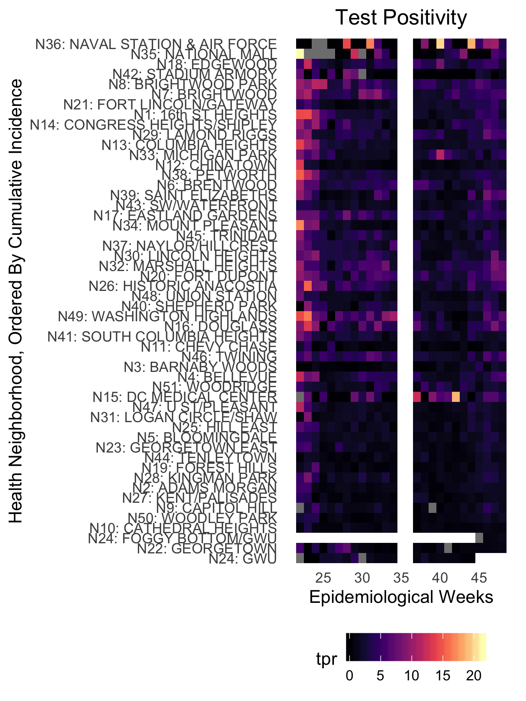
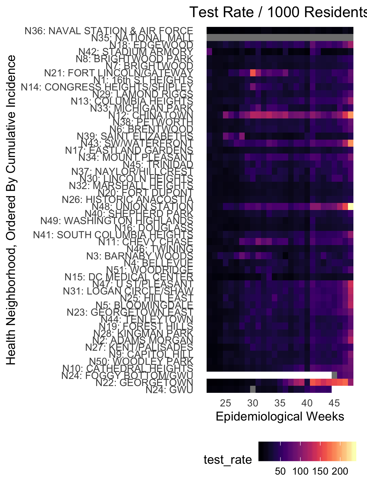

# DC COVID

The lingering high positivity and lower testing rates in the low-income neighborhoods hit hard by COVID-19 early on indicate that the lopsided effects of COVID-19 continue in DC

## DC Neighborhood Test Positivity, May 23 to November 27

## DC Neighborhood Test Rate / 1000 Residents, May 23 to November 27

## DC Neighborhood Incidence Rate / 100,000 Residents, May 23 to November 27

